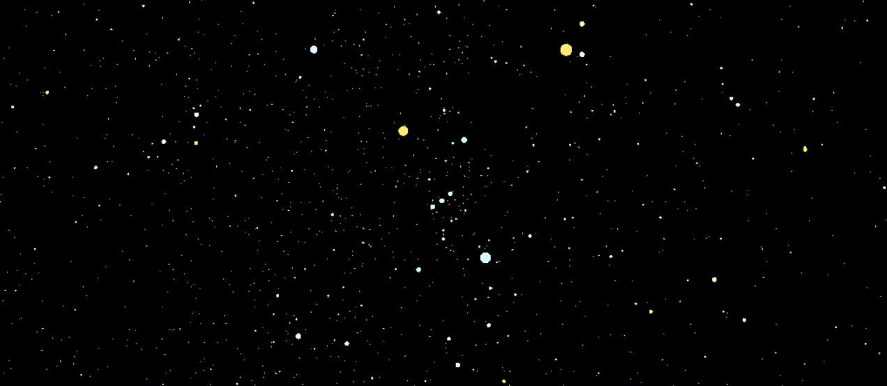

# HIP_VRC

## Description
ヒッパルコス星表にある星の位置、色、明るさのデータを元に点を描画するシェーダーです。

* [Kuwamai/HipParticle](https://github.com/Kuwamai/HipParticle)
  * 星のパーティクルに加えて星座線や星の名称を追加したパッケージを作成しました
  * 今後はこちらを更新します

## Usage
1. [Releases](https://github.com/Kuwamai/HIP_VRC/releases)からUnitypackageをダウンロードします
1. Unity projectにUnitypackageをimportします
1. Star_particle.prefabをHierarchieに配置します
1. 星の大きさはInspectorで変更できます
  * Mag_param
    * 星の大きさ
  * Mag_min
    * 大きさの最小値

## References & Includings
Star_particle.shaderはPhi16_さんが書いてくださった[pointcloud.shader](https://twitter.com/phi16_/status/1041256230545612800)を一部改変して作成しました。

## License
This repository is licensed under the MIT license, see [LICENSE](./LICENSE).
